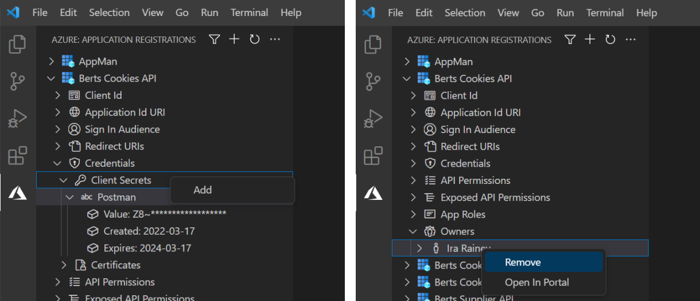
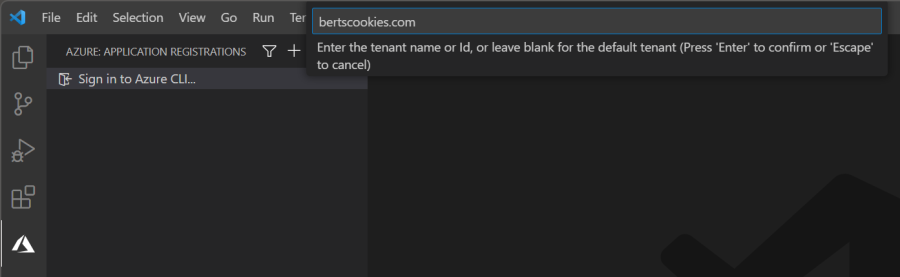
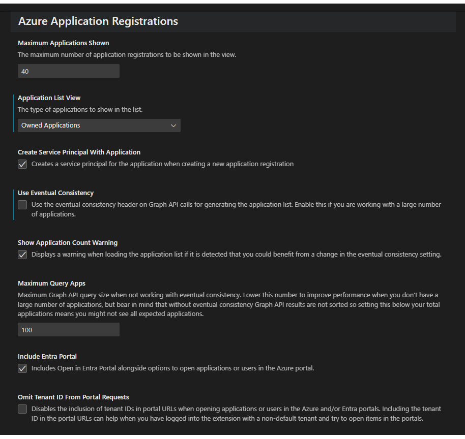

# Azure Application Registration Management for VS Code

This Visual Studio Code extension provides an easy way to view and manage Azure Application Registrations outside of the Azure Portal.

It allows for easy viewing, copying, adding, and editing of most the core application properties, such as:

* Client Id
* Sign In Audience
* Redirect URIs
* API Permissions
* Exposed API Permissions
* App Roles
* Owners

It also allows for the simple creation of new applications, quickly viewing of the full application manifest in the editor, and has the ability to open the application registration directly in the Azure Portal when you need full editing control. Once loaded, the application registration list can also be filtered by display name.

All application properties have their own range of functionality. From the top-level application itself, down to each individual property, functionality can be accessed via a range of context menus. If required functionality is not currently implemented for a particular property then you can open the application registration in the Azure portal from the context menu of the application itself.

By default, to improve performance, the application list is limited to show 50 applications. This however is exposed as a user setting and can be changed if you wish. The list is sorted by application name. If your application is not shown in the list you can also apply a filter on application name, which is applied before the maximum application limit _(although only when eventual consistency is applied - see section below)_.

The default view only shows applications where the signed in user is an owner. This default behaviour can be changed in user settings to show all applications if required.

## Authentication
This extension uses the `AzureCliCredential` to authenticate the user and gain an access token required to manage applications. This means it does not use the Azure Account identity, but rather the Azure CLI. This is a workaround due to a [known issue](https://learn.microsoft.com/en-us/javascript/api/overview/azure/identity-readme?view=azure-node-latest#note-about-visualstudiocodecredential) with the `VisualStudioCodeCredential` and Azure Account extension >= v0.10.0.

Please ensure your Azure CLI is authenticated to the correct tenant using `az login --tenant <tenant_name or tenant_id>`. If you are not authenticated using the Azure CLI the extension will offer the opportunity to sign in to the tenant of your choice.

The access token used for this extension uses the scope `Directory.AccessAsUser.All`. This means that it will use the Azure RBAC directory roles assigned to the authenticated user, and hence requires a role that allows for application management. More details on this scope can be found on this [Microsoft Graph Permission Explorer](https://graphpermissions.merill.net/permission/Directory.AccessAsUser.All).

## Eventual Consistency
Azure Active Directory stores multiple copies of data to handle large read volume and provide high availability. When data is created or updated, the change will eventually be applied to all the copies. This means that occasionally after making changes they may not initially be reflected in the application list. It can take anything from a few seconds to a few minutes for all copies to be updated, hence the term **Eventual**.

Microsoft Graph API manages this with the use of an eventual consistency header in API requests. Adding this header means the API will only return the results of objects where all copies have been updated. This can sometimes lead to confusing results.

Furthermore, some [advanced query functionality of Graph API](https://learn.microsoft.com/en-us/graph/aad-advanced-queries?tabs=javascript) such as server-side ordering and filtering only works when explicitly telling the API to use eventual consistency. To deliver a better user experience this extension offers the ability to make Graph API calls with or without the eventual consistency header required for advanced queries. This can be enabled or disabled in the user settings _(see section below)_.

As a rule of thumb, if you are working with a small list of applications (less than 200 in total) it is recommended to disable the use of the eventual consistency header _(this is the default)_. The application list will then be ordered client-side, although the filter option will be unavailable.

If you are working with a large list of applications (more than 200 in total) then it is recommended to enable the use of the eventual consistency header. This will allow the list of applications to be filter server-side and enforce the application of the filter command before results are returned.

If you have enabled the use of the eventual consistency header experience and some applications or properties are not initially showing correctly after creation or editing then simply wait a short time and refresh the list again. Read more on [Eventual Consistency](https://blogs.aaddevsup.xyz/2021/08/why-do-i-sometimes-get-a-404-when-trying-to-update-an-azure-directory-object-after-i-just-created-it/).

## User Settings

There are a number of user settings to control the behaviour of this extension. These are:

* **Maximum Applications Shown**
    * This controls how many applications to show in the list. When **Use Eventual Consistency** is enabled this will be ordered by display name on by the Graph API. If it is not enabled then applications are ordered client-side from the total list defined in **Maximum Query Apps**. Default value is `50`.
* **Show Owned Applications Only**
    * When selected the list of applications shown will only be where the current logged in user has been added as an owner. Uncheck this option to show all applications in the current tenant. Default value is `true`.
* **Use Eventual Consistency**
    * When selected the `ConsistencyLevel: eventual` header is added to Graph API calls. This opens up the opportunity for advanced query functionality such as server-side ordering and filtering. However enabling this setting results in applications and properties only being shown in the list when all copies have been updated. This can lead to a delay in recent changes being shown. If you are working with a large number of applications (more than 200) it is recommended to enable this. Default value is `enabled`.
* **Show Application Count Warning**
    * With this enabled the total number of applications you have in your tenant will be counted and a warning will be displayed if it is determined your **Use Eventual Consistency** setting is not set to the optimal value for you. Default value is `true`.
* **Maximum Query Apps**
    * This controls how many applications Graph API requests in the initial query when **Use Eventual Consistency** is _not_ enabled. There is a limit to how many results a single request will return before it paginates the results and if working with a small number of applications reducing this number can improve performance. Be aware though that due to the nature of Graph API and client-side ordering, reducing this to below **Maximum Applications Shown** could result in not seeing the applications you expect in the right order. Default value is `200`.

## Functionality In Progress
The following functionality has not yet been implemented, but is on the backlog for addition in future releases. If any of this functionality is required you can right-click the application and open in the portal blade to manage them. If you have any suggestions for useful functionality please get in touch.

* Pre-authorized applications
* Management of certificate credentials
* Android / iOS Redirect URIs
* Public flow settings
* Implicit flow settings
* Optional token claims
* Federation credentials
* Deleted applications

## Notes
This extension was created both as a learning exercise, and to address the common annoyances of managing Application Registrations. It is not officially supported and you use it at your own risk.

It has a dependency on the [Azure Tools extension pack](https://marketplace.visualstudio.com/items?itemName=ms-vscode.vscode-node-azure-pack), but only because it places the application registrations view into the Azure view container.
