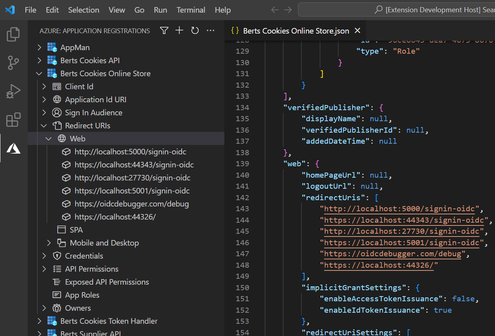
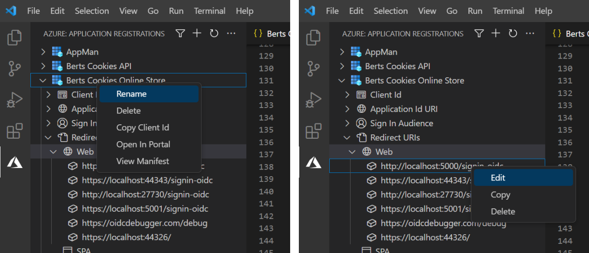

# Azure Application Registration Management for VS Code

This Visual Studio Code extension provides an easy way to view and manage Azure Application Registrations outside of the Azure Portal.

It allows for easy viewing, copying, adding, and editing of most the core application properties, such as:

* Client Id
* Sign In Audience
* Redirect URIs
* API Permissions
* Exposed API Permissions
* App Roles
* Owners

It also allows for the simple creation of new applications, quickly viewing of the full application manifest in the editor, and has the ability to open the application registration directly in the Azure Portal when you need full editing control. Once loaded, the application registration list can also be filtered by display name.

All application properties have their own range of functionality. From the top-level application itself, down to each individual property, functionality can be accessed via a range of context menus. If required functionality is not currently implemented for a particular property then you can open the application registration in the Azure portal from the context menu of the application itself.

By default, to improve performance, the application list is limited to 50 applications. This however is exposed as a user setting and can be changed if you wish. The list is sorted by application name. If your application is not shown in the list you can also apply a filter on application name, which is applied before the maximum application limit.

The default view only shows applications where the signed in user is an owner. This default behaviour can be changed in user settings to show all applications if required.

## Authentication
This extension uses the `AzureCliCredential` to authenticate the user and gain an access token required to manage applications. This means it does not use the Azure Account identity, but rather the Azure CLI. This is a workaround due to a [known issue](https://learn.microsoft.com/en-us/javascript/api/overview/azure/identity-readme?view=azure-node-latest#note-about-visualstudiocodecredential) with the `VisualStudioCodeCredential` and Azure Account extension >= v0.10.0.

Please ensure your Azure CLI is authenticated to the correct tenant using `az login --tenant <tenant_name or tenant_id>`. If you are not authenticated using the Azure CLI the extension will offer the opportunity to sign in to the tenant of your choice.

The access token used for this extension uses the scope `Directory.AccessAsUser.All`. This means that it will use the Azure RBAC directory roles assigned to the authenticated user, and hence requires a role that allows for application management. More details on this scope can be found on this [Microsoft Graph Permission Explorer](https://graphpermissions.merill.net/permission/Directory.AccessAsUser.All).

## Functionality In Progress
The following functionality has not yet been implemented, but is on the backlog for addition in future releases. If any of this functionality is required you can right-click the application and open in the portal blade to manage them. If you have any suggestions for useful functionality please get in touch.

* Pre-authorized applications
* Management of certificate credentials
* Android / iOS Redirect URIs
* Public flow settings
* Implicit flow settings
* Optional token claims
* Federation credentials
* Deleted applications

## Notes
This extension was created both as a learning exercise, and to address the common annoyances of managing Application Registrations. It is not officially supported and you use it at your own risk.

It has a dependency on the [Azure Tools extension pack](https://marketplace.visualstudio.com/items?itemName=ms-vscode.vscode-node-azure-pack), but only because it places the application registrations view into the Azure view container.

## Known Limitations
Azure Active Directory stores multiple copies of data to handle large read volume and provide high availability. When data is created or updated, the change will eventually be applied to all the copies. This means that occasionally after making changes the list may not initially reflect the new state. If this happens just wait a short time and refresh the list again. Read more on [Eventual Consistency](https://blogs.aaddevsup.xyz/2021/08/why-do-i-sometimes-get-a-404-when-trying-to-update-an-azure-directory-object-after-i-just-created-it/).
